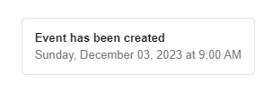

# Toast-Qwik

🎉 Qwik-Toast allows you to add notifications to your app with ease. No more nonsense!

## Installation

```
$ npm install --save toast-qwik
$ yarn add toast-qwik
$ bun install toast-qwik
$ npm install toast-qwik 
```
## Preview




## setting
_src/routes/layout.tsx_
```jsx
import { component$, Slot } from "@builder.io/qwik";
import { ToastProvider } from "toast-qwik";

export default component$(() => {
  return (
    <ToastProvider>
        <Slot />
    </ToastProvider>
    );
});
```

## use
_src/routes/index.tsx_
```jsx
import { component$ } from "@builder.io/qwik";
import { useToast } from "toast-qwik";

export default component$(() => {
  const {toast} = useToast();
  return (
    <>
      <button onClick$={() => {
        toast({
          title: "Awesome toast",
          message: "Toast Qwik description",
          closeable: true,
        })
      }}>
        Test toast
      </button>
    </>
  );
});
```
## Types

```jsx
toast({
          title: "Awesome toast",
          message: "Toast Qwik description",
          type: "success", // "success" | "warning" | "default" | "danger" | "info"
        })
```

<!-- ## options

```jsx
toast.info(`Test of toast Qwik`) //blue
toast.warn(`Test of toast Qwik`) // yellow
toast.success(`Test of toast Qwik`) // green
toast.default(`Test of toast Qwik`) // dark
toast.error(`Test of toast Qwik`) // red
``` -->

## actions

```jsx
toast({
  title: "Awesome toast",
  message: "Toast Qwik description",
  closeable: true,
  action: {
    content: 'SHOW',
    onAction: $(() => console.log('SHOW'))
  }
})
```

